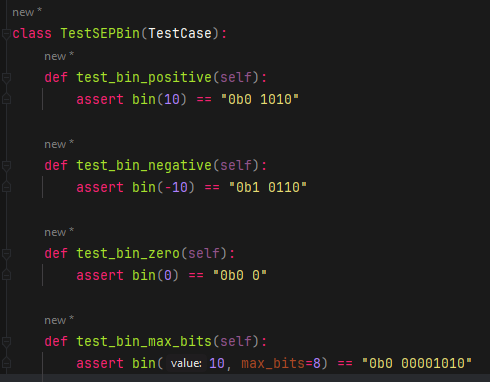

# Report for Assignment 1 resit

## Project chosen

Name: aenum

URL: https://github.com/ethanfurman/aenum

Number of lines of code and the tool used to count it: 3241 (`lizard aenum -x"*test*"`)

Programming language: Python

## Coverage measurement with existing tool

`coverage.py` was run to analyze the existing coverage:

### Function 1

`aenum/_enum.py:bin()`: 0% branch coverage

### Function 2:

`aenum/_enum.py:bits()`: 0% branch coverage

## Coverage improvement

### Individual tests

### Function 1

Tests ([aenum/test_sep.py:5](aenum/test_sep.py#L5)):

Initial coverage: 0% branch coverage

Improvement: 100% branch coverage

### Function 2

Tests ([aenum/test_sep.py:19](aenum/test_sep.py#L19)):

Initial coverage: 0% branch coverage

Improvement: 100% branch coverage

### Overall

Initial: 84% _line_ coverage on `_enum.py`

Improvement: 85% _line_ coverage on `_enum.py`

